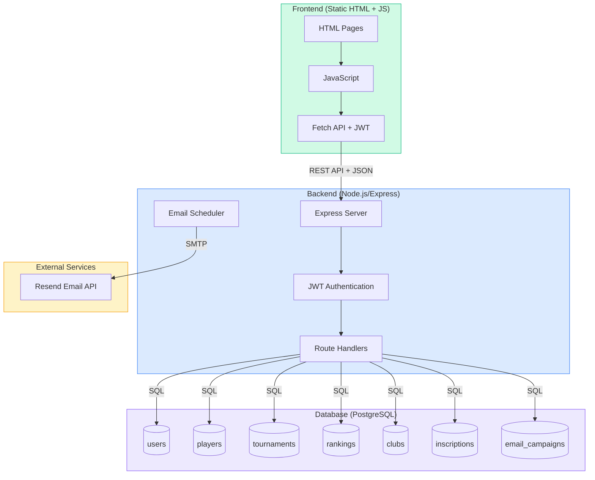
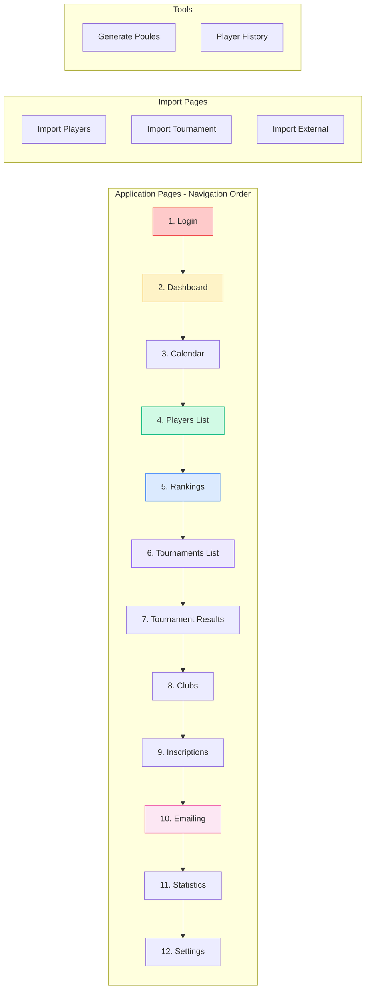
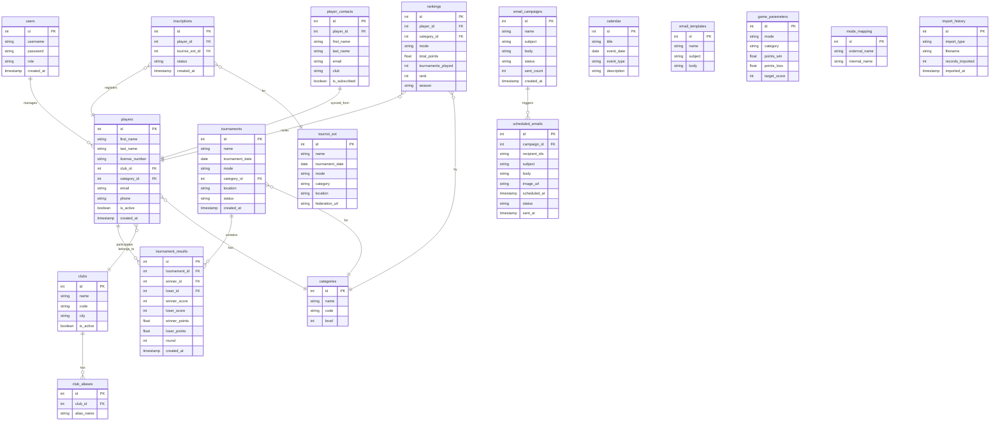
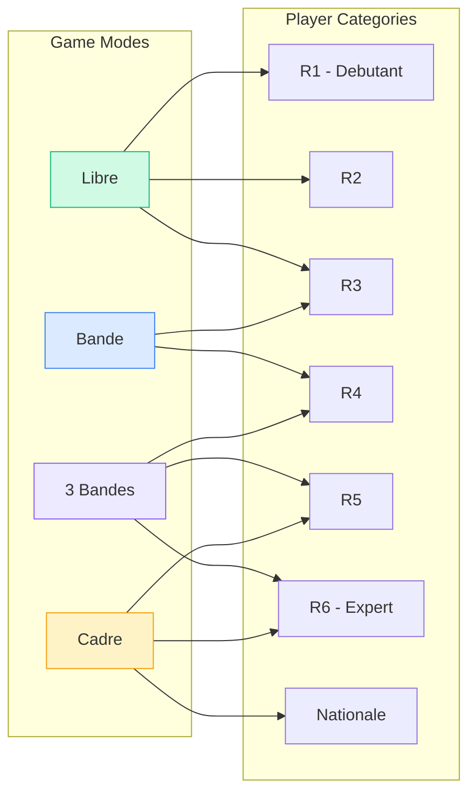
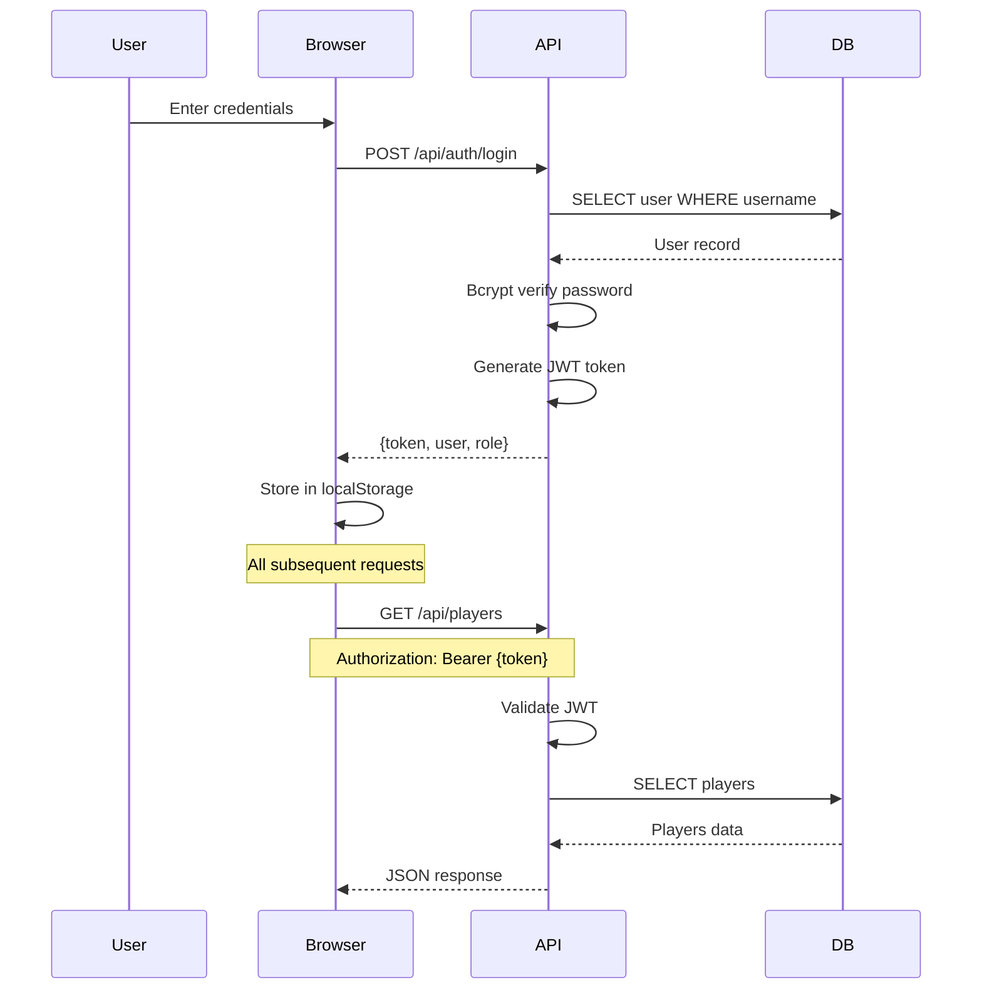
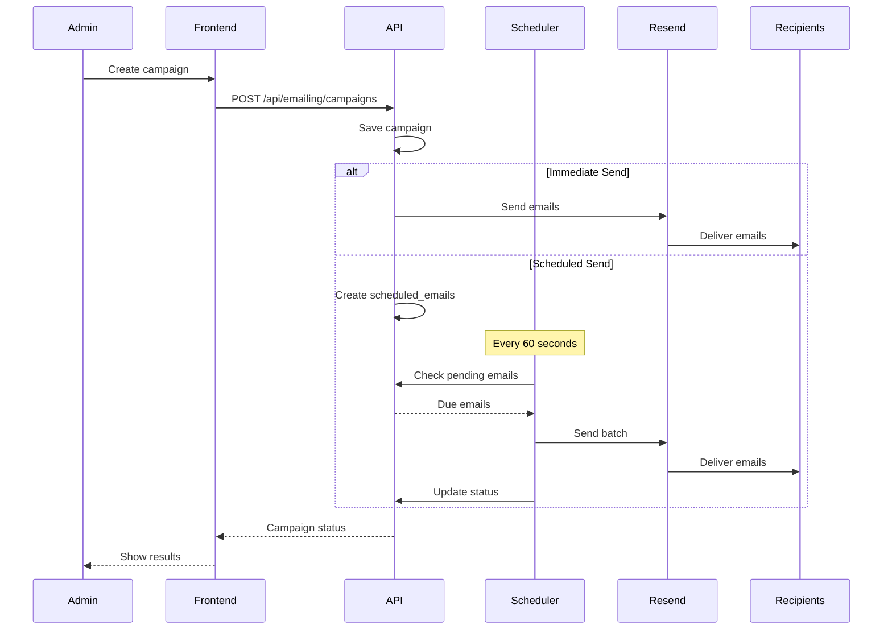
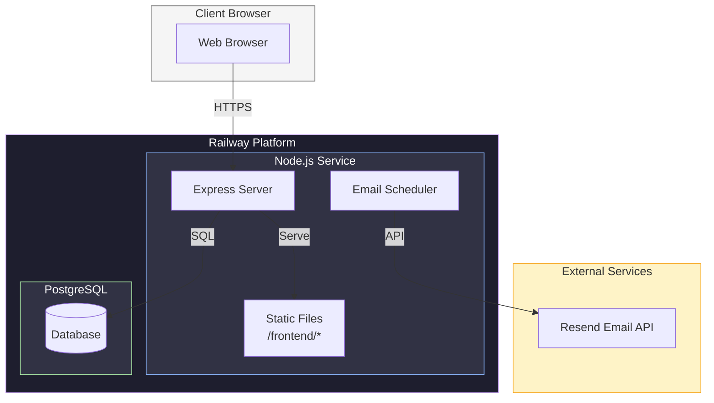

# CDBHS Tournament Management - Architecture Diagrams

## System Overview

## Frontend Pages

## Pages to Database Tables Mapping

```mermaid
graph TB
    subgraph Pages["Frontend Pages"]
        P1["1. Login"]
        P2["2. Dashboard"]
        P3["3. Calendar"]
        P4["4. Players List"]
        P5["5. Rankings"]
        P6["6. Tournaments"]
        P7["7. Results"]
        P8["8. Clubs"]
        P9["9. Inscriptions"]
        P10["10. Emailing"]
        P11["11. Statistics"]
        P12["12. Settings"]
    end

    subgraph Tables["Database Tables"]
        DB1[(users)]
        DB2[(players)]
        DB3[(categories)]
        DB4[(tournaments)]
        DB5[(tournament_results)]
        DB6[(rankings)]
        DB7[(clubs)]
        DB8[(club_aliases)]
        DB9[(inscriptions)]
        DB10[(tournoi_ext)]
        DB11[(calendar)]
        DB12[(player_contacts)]
        DB13[(email_campaigns)]
        DB14[(email_templates)]
        DB15[(scheduled_emails)]
        DB16[(game_parameters)]
        DB17[(mode_mapping)]
        DB18[(import_history)]
    end

    P1 -->|auth| DB1

    P2 -->|read| DB2
    P2 -->|read| DB4
    P2 -->|read| DB6

    P3 -->|CRUD| DB11
    P3 -->|read| DB4

    P4 -->|CRUD| DB2
    P4 -->|read| DB3
    P4 -->|read| DB7

    P5 -->|read/write| DB6
    P5 -->|read| DB2
    P5 -->|read| DB3

    P6 -->|CRUD| DB4
    P6 -->|read| DB3

    P7 -->|CRUD| DB5
    P7 -->|read| DB4
    P7 -->|read| DB2

    P8 -->|CRUD| DB7
    P8 -->|CRUD| DB8

    P9 -->|CRUD| DB9
    P9 -->|read| DB10
    P9 -->|read| DB2

    P10 -->|CRUD| DB12
    P10 -->|CRUD| DB13
    P10 -->|CRUD| DB14
    P10 -->|CRUD| DB15

    P11 -->|read| DB2
    P11 -->|read| DB4
    P11 -->|read| DB5

    P12 -->|CRUD| DB16
    P12 -->|CRUD| DB17
    P12 -->|read| DB18

    style P1 fill:#fecaca,stroke:#ef4444
    style P2 fill:#fef3c7,stroke:#f59e0b
    style P4 fill:#d1fae5,stroke:#10b981
    style P5 fill:#dbeafe,stroke:#3b82f6
    style P10 fill:#fce7f3,stroke:#ec4899

    style DB1 fill:#fee2e2,stroke:#ef4444
    style DB2 fill:#d1fae5,stroke:#10b981
    style DB4 fill:#ede9fe,stroke:#8b5cf6
    style DB6 fill:#dbeafe,stroke:#3b82f6
    style DB13 fill:#fce7f3,stroke:#ec4899
```

## Database Tables Summary

| Table | Description | Used By |
|-------|-------------|---------|
| `users` | Admin accounts & authentication | Login |
| `players` | Player profiles (name, license, category, club) | Players List, Rankings, Results, Statistics |
| `categories` | Player categories (R1-R6, Nationale, etc.) | Players, Rankings, Tournaments |
| `tournaments` | Tournament definitions (name, date, mode, category) | Tournaments List, Calendar, Dashboard |
| `tournament_results` | Match results (winner, loser, scores, points) | Tournament Results, Rankings, Statistics |
| `rankings` | Computed rankings by mode/category | Rankings, Dashboard |
| `clubs` | Club definitions (name, code) | Players, Clubs |
| `club_aliases` | Alternative club names for matching | Import, Clubs |
| `inscriptions` | Tournament registrations | Inscriptions List |
| `tournoi_ext` | External tournaments (federation) | Inscriptions |
| `calendar` | Calendar events | Calendar |
| `player_contacts` | Email contacts synced from players | Emailing |
| `email_campaigns` | Email campaign tracking | Emailing |
| `email_templates` | Reusable email templates | Emailing |
| `scheduled_emails` | Scheduled emails queue | Email Scheduler |
| `game_parameters` | Billiard game parameters per mode | Settings |
| `mode_mapping` | Mode name mappings | Settings, Import |
| `import_history` | Import audit trail | Settings |

## API Routes

```mermaid
graph TD
    subgraph Auth["/api/auth"]
        A1[POST /login]
        A2[POST /register]
        A3[GET /users]
        A4[POST /change-password]
    end

    subgraph Players["/api/players"]
        P1[GET /]
        P2[POST /]
        P3[PUT /:id]
        P4[DELETE /:id]
        P5[GET /:id/history]
        P6[POST /sync-contacts]
    end

    subgraph Tournaments["/api/tournaments"]
        T1[GET /]
        T2[POST /]
        T3[PUT /:id]
        T4[DELETE /:id]
        T5[GET /:id/results]
        T6[POST /:id/results]
    end

    subgraph Rankings["/api/rankings"]
        R1[GET /]
        R2[POST /calculate]
        R3[GET /export]
    end

    subgraph Calendar["/api/calendar"]
        C1[GET /]
        C2[POST /]
        C3[PUT /:id]
        C4[DELETE /:id]
    end

    subgraph Clubs["/api/clubs"]
        CL1[GET /]
        CL2[POST /]
        CL3[PUT /:id]
        CL4[DELETE /:id]
        CL5[GET /aliases]
        CL6[POST /aliases]
    end

    subgraph Inscriptions["/api/inscriptions"]
        I1[GET /]
        I2[POST /]
        I3[DELETE /:id]
        I4[GET /external-tournaments]
    end

    subgraph Emailing["/api/emailing"]
        E1[GET /contacts]
        E2[POST /campaigns]
        E3[GET /templates]
        E4[POST /send]
        E5[POST /schedule]
    end

    subgraph Statistics["/api/statistics"]
        S1[GET /overview]
        S2[GET /by-player]
        S3[GET /by-club]
    end

    subgraph Settings["/api/settings"]
        ST1[GET /parameters]
        ST2[POST /parameters]
        ST3[GET /modes]
    end

    subgraph Backup["/api/backup"]
        B1[GET /export]
        B2[POST /import]
    end

    style Auth fill:#fecaca,stroke:#ef4444
    style Players fill:#d1fae5,stroke:#10b981
    style Tournaments fill:#ede9fe,stroke:#8b5cf6
    style Rankings fill:#dbeafe,stroke:#3b82f6
    style Emailing fill:#fce7f3,stroke:#ec4899
    style Settings fill:#fef3c7,stroke:#f59e0b
```

## Database Schema

## Billiard Game Modes

## Authentication Flow

## Email Campaign Flow

## Deployment Architecture

---

## How to View These Diagrams

1. **GitHub**: Push this file to your repo - GitHub renders Mermaid automatically
2. **VS Code**: Install "Markdown Preview Mermaid Support" extension
3. **Online**: Paste diagrams at [mermaid.live](https://mermaid.live)
4. **Obsidian**: Native Mermaid support in notes
